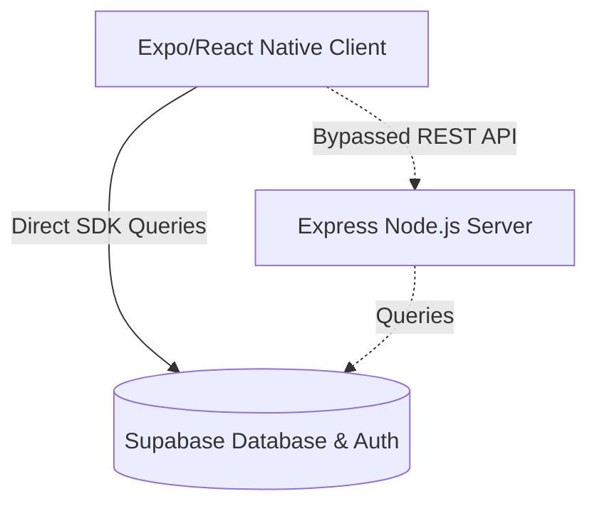

# System Architecture

This document describes the architectural patterns, layout, and data flow of the LogiSales application.

## Client-Server Architecture
The system consists of a mobile-first client application communicating directly with a cloud database service (Supabase). 

## Navigation & Routing (Expo Router)
The application utilizes file-based routing:
- **Root Layout (`app/_layout.tsx`)**: Manages the application context, themes, and global initialization.
- **Authentication Stack (`app/(auth)/`)**: Contains login and registration screens.
- **Tab Dashboard Layout (`app/(tabs)/`)**: Manages the main module navigation:
  - Dashboard Home (`index.tsx`)
  - Attendance Tracker (`attendance.tsx`)
  - Leads Directory (`leads.tsx`)
  - Enquiries Table/List (`enquiries.tsx`)
  - Follow-up Management (`followups.tsx`)
  - Visits Tracking (`visits.tsx`)
- **Detail Route (`app/enquiry/[id].tsx`)**: Renders details for a specific logistics/sales enquiry.

## Data Layer & Mappers
- Tables and views are mapped through TypeScript types (`lib/types.ts` and `lib/schema.ts`).
- `lib/salesperson-mappers.ts` provides utility mappers to bridge relational records (such as `sales_persons` or `sales_attendance`) with the state expected by the UI.
